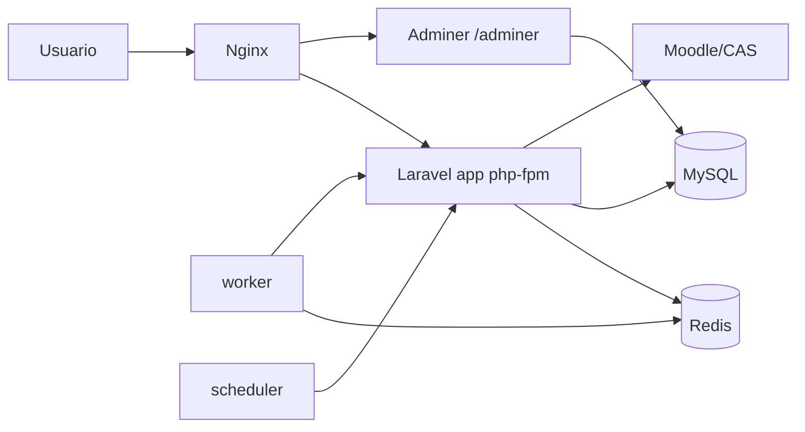
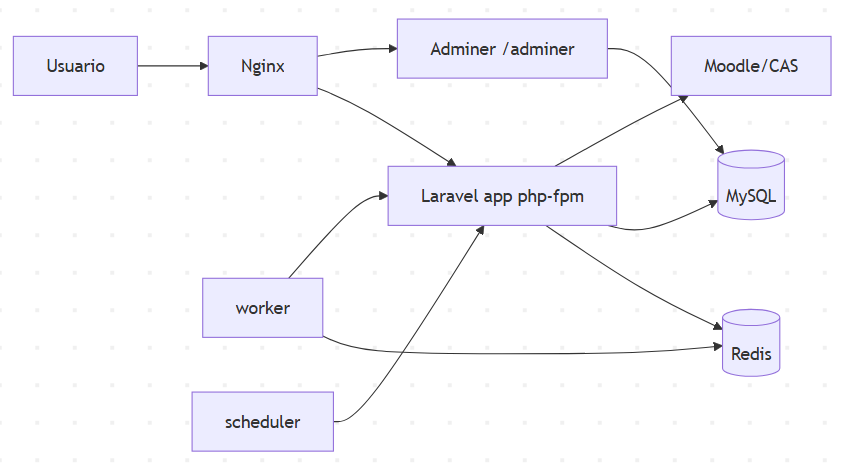

# OrganizaT

Aplicación web para alumnado de FP que centraliza información académica de Moodle en un panel unico de organización (tareas, calificaciones, recursos y prioridades).

## índice

- [1. documentación del proyecto](#1-documentación-del-proyecto)
- [2. Entregables mínimos](#2-entregables-mínimos)
- [3. Arquitectura](#3-arquitectura)
- [4. Requisitos previos](#4-requisitos-previos)
- [5. Arranque local](#5-arranque-local)
- [6. API, endpoints y documentación OpenAPI](#6-api-endpoints-y-documentación-openapi)
- [7. Calidad y pruebas](#7-calidad-y-pruebas)
- [8. CI/CD](#8-cicd)
- [9. Despliegue beta desde cero (Docker)](#9-despliegue-beta-desde-cero-docker)
- [10. Variables de entorno](#10-variables-de-entorno)
- [11. Verificación post-despliegue](#11-verificación-post-despliegue)
- [12. Troubleshooting básico](#12-troubleshooting-básico)
- [13. Enlaces útiles](#13-enlaces-útiles)

## 1. documentación del proyecto

índice directo a los 10 ficheros obligatorios de memoria:

1. [01-introduccion.md](docs/01-introduccion.md)
2. [02-descripcion.md](docs/02-descripcion.md)
3. [03-instalacion.md](docs/03-instalacion.md)
4. [04-guia-estilos.md](docs/04-guia-estilos.md)
5. [05-diseno.md](docs/05-diseno.md)
6. [06-desarrollo.md](docs/06-desarrollo.md)
7. [07-pruebas.md](docs/07-pruebas.md)
8. [08-despliegue.md](docs/08-despliegue.md)
9. [09-manual-usuario.md](docs/09-manual-usuario.md)
10. [10-conclusiones.md](docs/10-conclusiones.md)

Documento de apoyo para defensa:

- [11-memoria-final-tribunal.md](docs/11-memoria-final-tribunal.md)

## 2. Entregables mínimos

Este repositorio esta preparado para cubrir los mínimos de entrega:

1. Prototipo en Figma.
2. Repositorio con cliente y servidor.
3. Carpeta `docs/` con la documentación completa.
4. Aplicación desplegada en URL publica accesible.

## 3. Arquitectura

Stack principal:

1. Backend: Laravel 12 + Fortify + Wayfinder.
2. Frontend: Inertia + React + TypeScript.
3. Datos e infraestructura beta: MySQL 8.4 + Redis + Nginx + Docker Compose.
4. Procesamiento asíncrono: `worker` (colas) y `scheduler`.
5. Control de acceso: RBAC con roles `admin` / `user` y panel de administración en `/admin`.

Diagrama de arquitectura (runtime beta):





Servicios definidos en `docker-compose.beta.yml`:

- `app`
- `worker`
- `scheduler`
- `nginx`
- `redis`
- `db`
- `adminer`

## 4. Requisitos previos

### Desarrollo local

1. PHP `^8.2`.
2. Composer v2.
3. Node.js + npm.
4. Base de datos local (por defecto `sqlite` en `.env.example`).

### Entorno beta

1. Docker Engine.
2. Docker Compose plugin.
3. Archivo `.env` valido (sin placeholders).

## 5. Arranque local

### 5.1 Instalación

```bash
composer install
npm ci
cp .env.example .env
php artisan key:generate
php artisan migrate
```

### 5.2 Ejecutar en desarrollo

```bash
composer dev
```

`composer dev` levanta servidor Laravel, cola y Vite en paralelo.

## 6. API, endpoints y documentación OpenAPI

### 6.0 Documentación OpenAPI (Swagger)

La API dispone de **documentación OpenAPI 3.x generada automáticamente** mediante [dedoc/scramble](https://scramble.dedoc.co/).

| Recurso | URL (beta/producción) | URL (local) |
| --- | --- | --- |
| Swagger UI | `https://organizat.blete.tech/docs/api` | `http://localhost/docs/api` |
| JSON spec (OpenAPI) | `https://organizat.blete.tech/docs/api.json` | `http://localhost/docs/api.json` |

La documentación es **pública** (no requiere login para leer el spec). La API en sí requiere sesión activa.
Se sirve por el mismo dominio y la misma entrada HTTPS — no hay puerto adicional.
Ver documentación técnica completa en [docs/openapi.md](docs/openapi.md).

### 6.1 Nota de arquitectura de rutas

1. La aplicación principal funciona sobre Inertia (rutas web).
2. Existen endpoints JSON de soporte en prefijo `/api`.
3. Las rutas principales estan protegidas por middleware `auth` y `verified`.


### 6.1 Endpoints JSON principales

| Metodo | Endpoint | Parametros | Respuesta | Codigos |
| --- | --- | --- | --- | --- |
| GET | `/api/asignaturas` | - | JSON con cursos | `200`, `401`, `502`, `500` |
| GET | `/api/tareas/{courseId}` | `courseId` (path, int) | JSON con tareas de asignatura | `200`, `401`, `502`, `500` |
| GET | `/api/all-tareas` | - | JSON agregado de tareas | `200`, `401`, `502`, `500` |
| GET | `/api/calificaciones` | - | JSON con calificaciones | `200`, `401`, `502`, `500` |
| GET | `/api/recursos/{courseId}` | `courseId` (path, int) | JSON con recursos por asignatura | `200`, `401`, `502`, `500` |
| GET | `/api/all-recursos` | - | JSON agregado de recursos | `200`, `401`, `502`, `500` |
| GET | `/api/configuración` | - | JSON con preferencias | `200` |
| POST | `/api/configuración` | body con preferencias (`48h_antes`, `24h_antes`, `mismo_dia`, `recordatorio_personalizado_minutos`, `email`, `push`, ...) | JSON `{ message, data }` | `200`, `422` |

### 6.2 Endpoints funcionales web (no REST publico)

| Metodo | Endpoint | Parametros | Resultado |
| --- | --- | --- | --- |
| POST | `/moodle-connect` | `moodle_username`, `moodle_password` | Conecta cuenta Moodle (JSON o redirect segun request) |
| POST | `/dashboard/matrix` | `matrix_mode`, `ai_api_key` (opcional), `matrix_preferences` (opcional), `matrix_include_explanation` | Actualiza modo de matriz y redirige a dashboard |
| GET | `/tareas/export-all.ics` | - | Descarga archivo ICS (`text/calendar`) |
| GET | `/calificaciones/report` | `subject_id` (opcional, query) | Descarga PDF de calificaciones |
| POST | `/moodle-notifications/read-all` | - | Marca notificaciones como leidas |

### 6.3 Ejemplos curl (reales y reproducibles)

> Los endpoints protegidos requieren sesión autenticada. En curl se puede usar cookie jar.

```bash
# 1) Obtener login y guardar cookies (ajusta host)
curl -c cookies.txt http://localhost/login

# 2) Consultar estado dashboard con cookies de sesión
curl -b cookies.txt http://localhost/dashboard/status

# 3) Consultar tareas de una asignatura
curl -b cookies.txt http://localhost/api/tareas/123

# 4) Actualizar preferencias de notificacion
curl -b cookies.txt -X POST http://localhost/api/configuración \
  -H "Content-Type: application/json" \
  -d '{"48h_antes":true,"24h_antes":true,"mismo_dia":true,"email":true,"push":false}'

# 5) Descargar calendario ICS
curl -b cookies.txt -L http://localhost/tareas/export-all.ics -o tareas.ics

# 6) Descargar reporte PDF completo
curl -b cookies.txt -L http://localhost/calificaciones/report -o informe.pdf
```

## 7. Calidad y pruebas

Scripts relevantes:

```bash
# Backend
./vendor/bin/pest

# Frontend
npm run test
npm run lint:check
npm run types:check
npm run format:check

# Check frontend integrado
npm run cicheck

# Check PHP style
composer lint:check
```

Estado actual:

1. Hay suite real de pruebas backend.
2. Hay setup de Vitest para frontend.
3. La publicación de cobertura formal (artefacto porcentual) esta pendiente.

## 8. CI/CD

Workflows definidos en `.github/workflows/`:

1. `tests.yml` - build y tests (matrix PHP 8.4/8.5).
2. `lint.yml` - pint + lint + types + format check.
3. `deploy-beta.yml` - checks backend/frontend + build/push GHCR + deploy SSH.

## 9. Despliegue beta desde cero (Docker)

### 9.1 Preparar host Ubuntu

```bash
sudo apt update && sudo apt -y upgrade
sudo apt -y install ca-certificates curl gnupg git ufw
sudo ufw allow OpenSSH
sudo ufw allow 80/tcp
sudo ufw allow 443/tcp
sudo ufw --force enable
```

### 9.2 Clonar proyecto y preparar rama

```bash
git clone <URL_REPO> app
cd app
git fetch --all --prune
git switch deploy-beta
git pull origin deploy-beta
```

### 9.3 Configurar entorno

```bash
cp .env.beta.example .env
nano .env
```

### 9.4 Arranque recomendado

```bash
bash scripts/ops/bootstrap-droplet-beta.sh
```

Este script hace:

1. Instalación Docker si falta (Ubuntu).
2. Validacion de `.env` (bloquea placeholders).
3. Build y arranque de servicios.
4. Generacion de `APP_KEY` si falta.
5. `migrate --force`, `optimize`, `queue:restart`.
6. Checks de `/up`, Redis, worker y scheduler.

### 9.5 Crear usuario administrador

```bash
php artisan db:seed
```

Crea el usuario admin por defecto (`admin@admin.com` / `Admin1234!`).
**Cambiar la contraseña inmediatamente tras el primer acceso.**
El panel de administración está disponible en `/admin` (solo rol `admin`).

```bash
sh scripts/ops/first-boot-beta.sh
sh scripts/ops/inspect-beta.sh
```

## 10. Variables de entorno

Referencias:

1. Local: `.env.example`
2. Beta: `.env.beta.example`

Variables clave:

1. App: `APP_ENV`, `APP_KEY`, `APP_URL`, `APP_HTTP_PORT`.
2. BD: `DB_*`.
3. Redis/colas: `REDIS_*`, `SESSION_DRIVER`, `CACHE_STORE`, `QUEUE_CONNECTION`.
4. Moodle/CAS: `MOODLE_URL` o `MOODLE_BASE_URL`, `MOODLE_CAS_BASE`.
5. IA: `AI_BASE_URL`, `AI_API_KEY`, `AI_MODEL`.
6. Correo: `MAIL_MAILER`, `RESEND_API_KEY` o SMTP.

## 11. Verificación post-despliegue

```bash
docker compose -f docker-compose.beta.yml config
docker compose -f docker-compose.beta.yml ps
sh scripts/ops/inspect-beta.sh
curl -I http://127.0.0.1:${APP_HTTP_PORT:-80}/up
```

Checklist:

- [ ] Servicios `app`, `worker`, `scheduler`, `nginx`, `redis`, `db` en estado correcto.
- [ ] `/up` responde.
- [ ] Migraciones aplicadas.
- [ ] Worker y scheduler activos.
- [ ] Sin errores críticos repetidos en logs.

## 12. Troubleshooting básico

1. `APP_KEY` vacia: ejecutar bootstrap o `php artisan key:generate`.
2. Error de Moodle/CAS: revisar variables `MOODLE_*` y validez de sesión.
3. No envia correo: revisar `MAIL_MAILER` y credenciales, y estado de `worker`.
4. Redis warning `vm.overcommit_memory`: aplicar ajuste de `sysctl` en host.
5. Fallo en reportes 404 por email: revisar configuración de mail real (no `log/array`).

## 13. Enlaces útiles

- Prototipo Figma: <https://www.figma.com/design/H4suweb5Pc2qJqUs7iRXQ9/Prototipo_TFG_PFF?node-id=0-1&t=Dou0TuJGGV2lCw4X-1>
- documentación 01-10: [docs/](docs/)
- URL publica beta/producción: https://organizat.blete.tech.
- Swagger UI: https://organizat.blete.tech/docs/api
- OpenAPI JSON spec: https://organizat.blete.tech/docs/api.json

