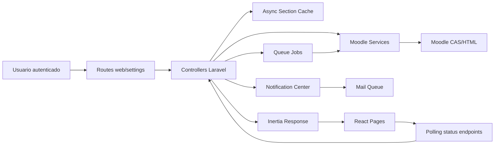
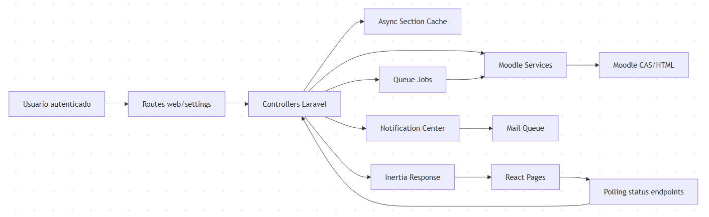
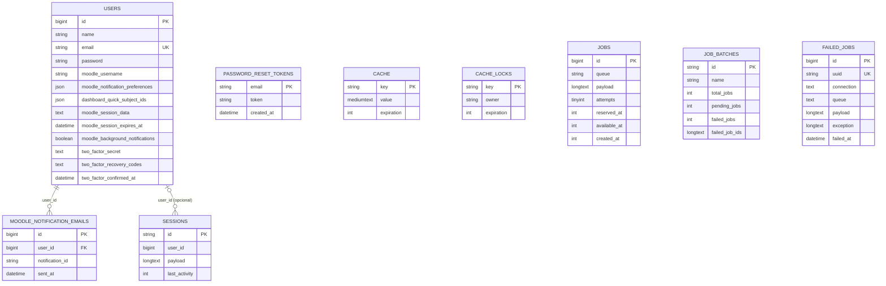
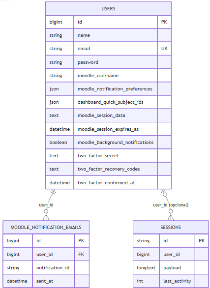
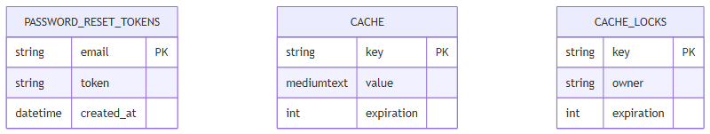
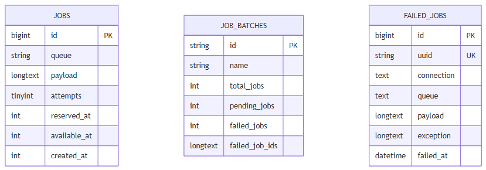
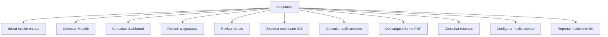
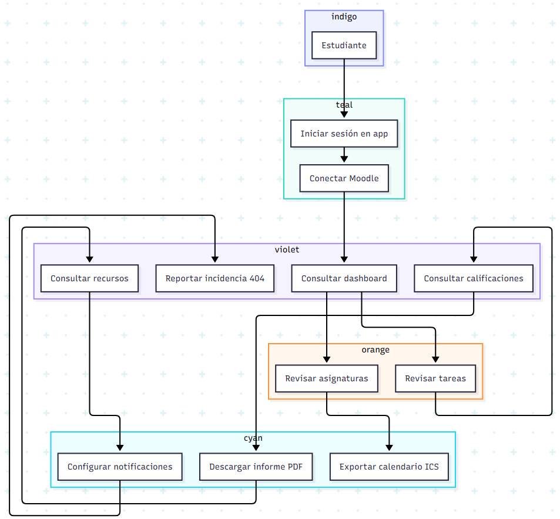
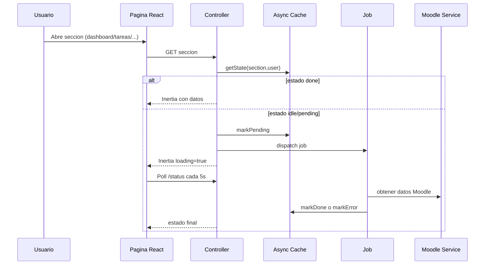
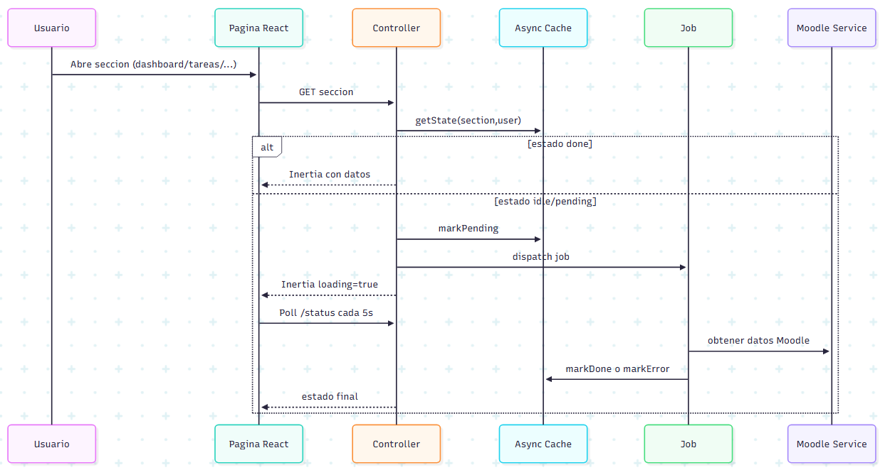

# 5. Diseño

## 5.1 Arquitectura de la aplicación
La arquitectura que he aplicado es MVC con separacion clara de capas:

1. Rutas y controladores en Laravel.
2. Servicios de dominio para lógica Moodle, cache, notificaciones y reglas academicas.
3. Jobs de cola para carga asíncrona por sección.
4. Frontend Inertia + React para renderizado y UX.

### Diagrama de arquitectura lógica

## 5.2 Modelo de datos (ER)
El proyecto se apoya en tablas base de Laravel y ampliaciones en users para integración Moodle y seguridad.

### Entidades principales

1. users.
2. sessions.
3. password_reset_tokens.
4. cache y cache_locks.
5. jobs, job_batches, failed_jobs.
6. moodle_notification_emails.

### Diagrama entidad-relacion

## 5.3 Casos de uso

## 5.4 Flujo principal de sincronizacion académica

## 5.5 Diseño de API y endpoints
He separado rutas de vista y endpoints JSON de soporte.

### Rutas de vista (web)

1. /dashboard, /asignaturas, /tareas, /calificaciones, /recursos.
2. /settings/security y /settings/profile.
3. /moodle-console.

### Endpoints de estado asíncrono

1. /dashboard/status
2. /asignaturas/status
3. /tareas/status
4. /calificaciones/status
5. /recursos/status

### Endpoints funcionales

1. POST /dashboard/matrix
2. GET /tareas/export-all.ics
3. GET /calificaciones/report
4. POST /moodle-notifications/read-all
5. GET /moodle/media y GET /moodle/redirect
6. POST /moodle-connect y POST /moodle-debug
7. POST /moodle/preferences/background-notifications

### Endpoints bajo prefijo /api

1. GET /api/asignaturas
2. GET /api/tareas/{courseId}
3. GET /api/all-tareas
4. GET /api/calificaciones
5. GET /api/recursos/{courseId}
6. GET /api/all-recursos
7. GET/POST /api/configuración

## 5.6 Decisiones de diseño destacadas

1. Capa de acceso Moodle separada en servicios para no contaminar controladores con parsing HTTP/HTML.
2. Cache por sección + jobs para mejorar respuesta inicial y controlar errores por dominio.
3. URLs de recursos Moodle tratadas mediante servicio dedicado para evitar roturas de sesión en navegador.
4. Persistencia de sesión Moodle en DB solo si el usuario activa notificaciones en background.

## 5.7 Coherencia diseño-desarrollo
Los diagramas anteriores no son teóricos: corresponden a rutas, clases y métodos reales ya presentes en el proyecto, y son la base que he usado para justificar decisiones en la implementación.

