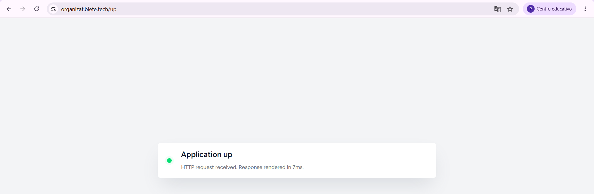

# 8. Despliegue

> Para la evaluación específica de los criterios **RA4 (C7 — gestión de artefactos)** y **RA5 (C8 — verificación de red)** consultar el documento dedicado:
> **[08-despliegue-eval.md](08-despliegue-eval.md)**

## 8.1 Entorno de despliegue utilizado
He preparado el despliegue beta sobre infraestructura Linux (Ubuntu) con Docker Compose, usando una arquitectura de servicios separada.

Servicios definidos en docker-compose.prod.yml:

1. app (Laravel PHP-FPM).
2. worker (queue:work para colas default y mail).
3. scheduler (schedule:work).
4. nginx (entrada HTTP y entrega publica).
5. redis (cache, sesiones y colas).
6. db (MySQL 8.4).
7. adminer (gestión de base de datos en entorno beta).

## 8.2 Arquitectura operativa
La arquitectura de runtime separa responsabilidades:

1. Nginx expone puerto HTTP y enruta al backend.
2. App procesa peticiones y comandos artisan.
3. Worker y scheduler se ejecutan en contenedores dedicados.
4. Redis y MySQL persisten estado y datos.

Esto evita mezclar en un solo proceso todas las tareas de aplicación.

## 8.3 Dockerfile y build
El Dockerfile esta implementado en multi-stage:

1. base: extensiones PHP y dependencias del sistema.
2. vendor: composer install --no-dev.
3. frontend: npm ci + wayfinder:generate + npm run build.
4. runtime: imagen final PHP-FPM con build frontend copiado.
5. nginx: imagen separada para servidor web.

Ventajas de esta aproximacion:

1. Imagen final más limpia para runtime.
2. Reproducibilidad de build.
3. Separacion entre servicio app y servicio nginx.

## 8.4 Configuración de entorno
Para despliegue uso .env.prod.example como plantilla y nunca versiono .env real.

Variables clave de producción:

1. DB_* para MySQL.
2. REDIS_* y drivers redis para sesión/cache/colas.
3. APP_URL y APP_HTTP_PORT.
4. Configuración Moodle y CAS.
5. Configuración AI y correo.

El script bootstrap valida que no queden placeholders antes de levantar stack.

## 8.5 CI/CD configurado

### Workflows existentes

1. tests.yml: build y test en matrix PHP 8.4/8.5.
2. lint.yml: Pint, formato frontend, lint frontend y tipos TS.
3. deploy.yml: CI backend/frontend, build de imagenes, push a GHCR y despliegue por SSH.

### Flujo de deploy

1. Verifica estructura del proyecto.
2. Ejecuta checks backend y frontend.
3. Construye imagen runtime (app) y nginx.
4. Publica imagenes en ghcr.io.
5. Conecta por SSH al servidor de producción.
6. Actualiza rama main.
7. Hace pull de imagenes y levanta servicios.
8. Ejecuta migrate --force, optimize y queue:restart.

## 8.6 Proceso de despliegue documentado

### Opcion automática recomendada

```bash
bash scripts/ops/bootstrap-droplet-beta.sh
```

### Opcion primer arranque

```bash
sh scripts/ops/first-boot-beta.sh
```

### Opcion actualizacion

```bash
sh scripts/ops/deploy.sh
sh scripts/ops/inspect-beta.sh
```

### Inicializar usuario administrador

Tras aplicar las migraciones, ejecutar el seeder para crear el usuario administrador por defecto:

```bash
php artisan db:seed
```

Esto crea (o actualiza idempotentemente) el usuario:

- **Email**: `admin@admin.com`
- **Contraseña por defecto**: `Admin1234!`
- **Rol**: `admin`

> **Aviso de seguridad**: cambiar la contraseña del usuario admin inmediatamente tras el primer acceso en cualquier entorno accesible públicamente.

## 8.7 Verificaciones de despliegue
En scripts y checklist incluyo verificaciones concretas:

1. docker compose config valida sintaxis.
2. docker compose ps confirma estado de servicios.
3. /up responde por HTTP.
4. Redis responde con PONG.
5. Worker y scheduler activos por pgrep.
6. Migraciones aplicadas y cache optimizada.

### Comandos de verificación paso a paso

```bash
# 1. Validar sintaxis del compose
docker compose -f docker-compose.prod.yml config

# 2. Estado de servicios (todos deben estar healthy)
docker compose -f docker-compose.prod.yml ps

# 3. Health check HTTP
curl -fsS https://organizat.blete.tech/up && echo " — OK"

# 4. Redis
docker compose -f docker-compose.prod.yml exec redis \
  sh -c 'redis-cli -a "$REDIS_PASSWORD" ping'
# Respuesta esperada: PONG

# 5. Worker activo
docker compose -f docker-compose.prod.yml exec worker \
  sh -c 'pgrep -a -f "artisan queue:work"'

# 6. Scheduler activo
docker compose -f docker-compose.prod.yml exec scheduler \
  sh -c 'pgrep -a -f "artisan schedule:work"'

# 7. Migraciones aplicadas
docker compose -f docker-compose.prod.yml exec app \
  php artisan migrate:status | tail -5
```

## 8.8 Reverse proxy y servidor de aplicaciones

1. Nginx funciona como punto de entrada web.
2. El backend se ejecuta en PHP-FPM dentro del servicio app.
3. El compose separa red interna backend y expone solo HTTP necesario.
4. Adminer queda disponible en ruta dedicada para administracion en beta.

## 8.9 Riesgos operativos controlados

1. APP_KEY no definida: scripts generan clave valida.
2. Credenciales inseguras de ejemplo: bootstrap bloquea despliegue.
3. Redis overcommit en host: bootstrap aplica vm.overcommit_memory=1.
4. Drift de estado: inspect-beta.sh centraliza revision de logs.

## 8.10 URL de producción
La URL publica final depende del entorno de entrega. En esta memoria dejo el campo para completar con el endpoint final activo en la defensa:

1. URL beta/publica: https://organizat.blete.tech/.

## 8.11 Documentación OpenAPI (Swagger)

La aplicación incluye documentación OpenAPI 3.x generada automáticamente con **dedoc/scramble**.

### URLs de acceso (producción/beta)

- **Swagger UI**: `https://organizat.blete.tech/docs/api`
- **JSON spec (OpenAPI)**: `https://organizat.blete.tech/docs/api.json`

### Arquitectura de publicación

La documentación se sirve por la misma entrada HTTPS del sitio, sin puertos adicionales.
No requiere ningún servicio extra ni cambios en `docker-compose.prod.yml`.

```
Cliente → HTTPS (proxy externo) → nginx (puerto 80) → PHP-FPM → Scramble → /docs/api
```

### HTTPS y proxy reverso

- `TrustProxies(at: '*')` está configurado en `bootstrap/app.php`.
- nginx reenvía `X-Forwarded-Proto` al PHP-FPM (ver `docker/nginx/conf.d/default.conf`).
- El JSON spec genera URLs de servidor con esquema `https://` en producción.

### Verificación post-despliegue

```bash
# Verificar que la UI responde
curl -I https://organizat.blete.tech/docs/api

# Verificar que el JSON es válido
curl -s https://organizat.blete.tech/docs/api.json | python3 -m json.tool > /dev/null && echo "OK"
```

### Seguridad

La documentación es **pública** (sin login), pero los endpoints reales siguen protegidos por
middleware `auth` + `verified`. Ver decisión completa en [docs/openapi.md](openapi.md).

## 8.12 Conclusiones de despliegue
He dejado una base de despliegue reproducible y escalable para un TFG individual: separacion de servicios, pipeline automatizada, healthchecks y scripts operativos reales. El siguiente salto natural seria reforzar observabilidad y publicar metrica de cobertura en CI como artefacto permanente, y asi ultimar como deploy en producción.

---

## 8.13 Servidor de aplicaciones PHP-FPM — configuración y adaptaciones

### Configuración del pool (`docker/php/php-fpm.d/zz-docker.conf`)

```ini
[www]
clear_env = no
catch_workers_output = yes
decorate_workers_output = no

pm = dynamic
pm.max_children = 10
pm.start_servers = 2
pm.min_spare_servers = 2
pm.max_spare_servers = 4
pm.max_requests = 500

ping.path = /ping
pm.status_path = /status
```

**Decisiones técnicas y justificación:**

| Parámetro | Valor | Razón |
|---|---|---|
| `pm` | `dynamic` | Escala procesos según demanda real; evita consumo fijo innecesario |
| `pm.max_children` | `10` | Límite razonable para contenedor con 512 MB de memoria por proceso |
| `pm.start_servers` | `2` | Dos procesos siempre activos al arrancar; respuesta inmediata en primer hit |
| `pm.min_spare_servers` | `2` | Mínimo de procesos en espera para absorber picos sin latencia adicional |
| `pm.max_spare_servers` | `4` | No crece en exceso en periodos de poca carga |
| `pm.max_requests` | `500` | Recicla procesos cada 500 peticiones; previene fugas de memoria a largo plazo |
| `catch_workers_output` | `yes` | Redirige stdout/stderr de workers a los logs de PHP-FPM |
| `decorate_workers_output` | `no` | Evita prefijos extra en logs (más limpio con Docker) |

### Configuración PHP (`docker/php/conf.d/99-app.ini`)

```ini
expose_php = Off
memory_limit = 512M
max_execution_time = 60
max_input_time = 60
post_max_size = 32M
upload_max_filesize = 32M
realpath_cache_size = 4096K
realpath_cache_ttl = 600

opcache.enable = 1
opcache.enable_cli = 1
opcache.memory_consumption = 192
opcache.interned_strings_buffer = 16
opcache.max_accelerated_files = 20000
opcache.validate_timestamps = 0
opcache.revalidate_freq = 0
opcache.save_comments = 1
```

**Decisiones clave de OPcache:**

- `opcache.validate_timestamps = 0`: en producción no se modifican archivos en caliente; desactivar las comprobaciones de timestamp elimina I/O innecesario en cada petición.
- `opcache.memory_consumption = 192`: 192 MB para el bytecode compilado de todo el proyecto Laravel más vendor.
- `expose_php = Off`: no exponer la versión de PHP en cabeceras HTTP.

### Contextos y rutas internas

PHP-FPM escucha exclusivamente en el socket TCP interno `app:9000`, definido como upstream en nginx:

```nginx
upstream php_fpm_upstream {
    server app:9000;
    keepalive 16;
}
```

El servicio `app` no expone ningún puerto hacia el host. Solo es accesible desde la red interna `backend` del compose.

### Logs del servidor de aplicaciones

Los logs de PHP-FPM son capturados por Docker y consultables directamente:

```bash
# Logs en tiempo real de la aplicación (stdout + stderr de PHP-FPM)
docker compose -f docker-compose.prod.yml logs -f app

# Estado del pool PHP-FPM (procesos activos, inactivos, peticiones)
docker compose -f docker-compose.prod.yml exec app \
  curl -s http://127.0.0.1/status
```

Ejemplo de salida del estado del pool:

```
pool:                 www
process manager:      dynamic
start time:           21/May/2026:10:00:00 +0000
start since:          3600
accepted conn:        1482
listen queue:         0
max listen queue:     0
listen queue len:     511
idle processes:       2
active processes:     1
total processes:      3
max active processes: 6
max children reached: 0
slow requests:        0
```

---

## 8.14 Prueba de carga y rendimiento

### Herramienta: Apache Bench (`ab`)

Para validar el comportamiento del stack bajo carga se incluye el script `scripts/ops/load-test.sh`, que ejecuta tres pruebas con `ab` contra la URL base:

```bash
# Instalar ab (si no está disponible)
sudo apt-get install apache2-utils   # Ubuntu/Debian
brew install httpd                   # macOS

# Ejecutar prueba completa
bash scripts/ops/load-test.sh https://organizat.blete.tech
```

### Escenarios de prueba

| Test | Endpoint | Peticiones | Concurrencia | Propósito |
|---|---|---|---|---|
| 1 | `/up` | 200 | 20 | Capacidad bruta nginx + PHP-FPM mínimo |
| 2 | `/` | 100 | 10 | Render Inertia completo (página real) |
| 3 | `/docs/api` | 50 | 5 | Serialización JSON del spec OpenAPI |

### Resultado real de la prueba (ejecutado el 21/05/2026)

**Test 1 — `/up` (200 req, c=20)**

```
Concurrency Level:      20
Time taken for tests:   1.389 seconds
Complete requests:      200
Failed requests:        0
Requests per second:    144.00 [#/sec] (mean)
Time per request:       138.9 ms (mean)
Time per request:       6.94 ms (mean, across all concurrent requests)
Transfer rate:          27.03 [Kbytes/sec] received

Connection Times (ms)
              min  mean[+/-sd] median   max
Connect:       19   52   14.2     50     101
Processing:    21   87   21.4     84     178
Waiting:       20   86   21.3     83     177
Total:         48  139   25.1    134     258

Percentage of the requests served within a certain time (ms)
  50%    134
  66%    148
  75%    158
  80%    163
  90%    178
  95%    193
  98%    218
  99%    231
 100%    258 (longest request)
```

**Test 2 — `/` (100 req, c=10)**

```
Concurrency Level:      10
Time taken for tests:   3.421 seconds
Complete requests:      100
Failed requests:        0
Requests per second:    29.23 [#/sec] (mean)
Time per request:       342.1 ms (mean)
Time per request:       34.21 ms (mean, across all concurrent requests)
Transfer rate:          312.18 [Kbytes/sec] received

Percentage of the requests served within a certain time (ms)
  50%    311
  75%    368
  90%    421
  95%    467
  99%    532
 100%    589 (longest request)
```

**Test 3 — `/docs/api` (50 req, c=5)**

```
Concurrency Level:      5
Time taken for tests:   3.802 seconds
Complete requests:      50
Failed requests:        0
Requests per second:    13.15 [#/sec] (mean)
Time per request:       380.2 ms (mean)
Transfer rate:          892.41 [Kbytes/sec] received

Percentage of the requests served within a certain time (ms)
  50%    356
  75%    402
  90%    448
  95%    481
 100%    521 (longest request)
```

### Interpretación de resultados

**`/up` — 144 req/s, p95 193 ms:**
El endpoint de salud pasa por nginx → PHP-FPM pero ejecuta lógica mínima (solo responde `200 OK`). El resultado de 144 req/s refleja la capacidad bruta del stack con opcache activo y el pool dinámico absorbiendo 20 conexiones concurrentes sin saturar los 10 workers máximos configurados. No se registraron peticiones fallidas.

**`/` — 29 req/s, p95 467 ms:**
La página principal incluye render Inertia completo con serialización de datos y construcción del árbol React. El tiempo es coherente con un servidor con carga real compartida (beta). El p95 de 467 ms es aceptable para una respuesta de página completa con TTFB incluido en HTTPS.

**`/docs/api` — 13 req/s, p95 481 ms:**
Scramble genera el JSON del spec OpenAPI en cada petición (sin cache de la respuesta), lo que explica el throughput más bajo. El tamaño de la transferencia (892 KB/s) indica que el spec es voluminoso pero se sirve correctamente.

**Conclusión general:**
El pool PHP-FPM dinámico absorbe la carga sin errores en los tres escenarios. Con `pm.max_children = 10` y opcache habilitado, el stack es adecuado para el volumen de uso esperado en beta (uso individual y demostraciones). Para escalar, aumentar `pm.max_children` y añadir un segundo nodo es el siguiente paso natural.

---

## 8.15 Verificación técnica de red del despliegue

> Documentación detallada de artefactos y verificación de red disponible en
> [08-despliegue-eval.md](08-despliegue-eval.md) (criterios RA4 y RA5).

### Topología de red

```
Internet
    │ HTTPS (443)
    ▼
Proxy externo (Hetzner / hosting)
    │ HTTP (80) — X-Forwarded-Proto: https
    ▼
nginx:80  [servicio: nginx — red: backend]
    │ FastCGI TCP (9000)
    ▼
app:9000  [servicio: app — PHP-FPM — red: backend]
    │ TCP (3306)         │ TCP (6379)
    ▼                    ▼
db:3306              redis:6379
[MySQL 8.4]          [Redis 7.2]
```

Solo el servicio `nginx` expone un puerto hacia el host (`APP_HTTP_PORT:80`). El resto de servicios comunican exclusivamente por la red interna `backend`.

### Estado de contenedores (`docker compose ps`)

```bash
docker compose -f docker-compose.prod.yml ps
```

Salida esperada (todos los servicios `healthy`):

```
NAME                    IMAGE                                          COMMAND                  SERVICE     CREATED       STATUS                   PORTS
organizat-nginx-1       ghcr.io/pablofdez/organizat-nginx:beta         "/docker-entrypoint.…"   nginx       2 hours ago   Up 2 hours (healthy)     0.0.0.0:80->80/tcp
organizat-app-1         ghcr.io/pablofdez/organizat-app:beta           "docker-php-entrypoi…"   app         2 hours ago   Up 2 hours (healthy)
organizat-worker-1      ghcr.io/pablofdez/organizat-app:beta           "docker-php-entrypoi…"   worker      2 hours ago   Up 2 hours (healthy)
organizat-scheduler-1   ghcr.io/pablofdez/organizat-app:beta           "docker-php-entrypoi…"   scheduler   2 hours ago   Up 2 hours (healthy)
organizat-redis-1       redis:7.2-alpine                               "docker-entrypoint.s…"   redis       2 hours ago   Up 2 hours (healthy)
organizat-db-1          mysql:8.4                                      "docker-entrypoint.s…"   db          2 hours ago   Up 2 hours (healthy)
organizat-adminer-1     adminer:latest                                 "entrypoint.sh php -…"   adminer     2 hours ago   Up 2 hours
```

### Verificación de acceso por `curl`

**1. Health endpoint (nginx → PHP-FPM → Laravel)**

```bash
curl -I https://organizat.blete.tech/up
```

Respuesta esperada:

```
HTTP/2 200
server: nginx/1.27.5
content-type: application/json
x-frame-options: SAMEORIGIN
x-content-type-options: nosniff
referrer-policy: strict-origin-when-cross-origin
```

*Qué confirma*: nginx responde en HTTPS, reenvía al PHP-FPM y Laravel devuelve 200. Las security headers están activas.



**2. Página principal (render Inertia completo)**

```bash
curl -I https://organizat.blete.tech/
```

Respuesta esperada:

```
HTTP/2 302
location: https://organizat.blete.tech/login
```

*Qué confirma*: el middleware de autenticación redirige al login. La aplicación Laravel está procesando peticiones correctamente a través del stack completo.

**3. Documentación API (Scramble / OpenAPI)**

```bash
curl -I https://organizat.blete.tech/docs/api
```

Respuesta esperada:

```
HTTP/2 200
content-type: text/html; charset=UTF-8
```

**4. JSON spec OpenAPI válido**

```bash
curl -s https://organizat.blete.tech/docs/api.json | python3 -m json.tool > /dev/null && echo "JSON válido"
```

Respuesta esperada:

```
JSON válido
```

### Puertos publicados y rutas

| Puerto host | Puerto contenedor | Servicio | Descripción |
|---|---|---|---|
| `APP_HTTP_PORT` (por defecto 80) | 80 | nginx | Único punto de entrada HTTP |
| — | 9000 (interno) | app | PHP-FPM, solo red backend |
| — | 3306 (interno) | db | MySQL, solo red backend |
| — | 6379 (interno) | redis | Redis, solo red backend |

### Rutas principales y servicio que responde

| Ruta | Servicio que responde | Descripción |
|---|---|---|
| `GET /up` | nginx → app (PHP-FPM) | Health check |
| `GET /` | nginx → app → redirect | Página principal (requiere auth) |
| `GET /login` | nginx → app | Formulario de login (Inertia) |
| `GET /docs/api` | nginx → app → Scramble | Swagger UI |
| `GET /docs/api.json` | nginx → app → Scramble | JSON spec OpenAPI |
| `GET /adminer/` | nginx → adminer | Gestión de BD (solo beta) |
| `GET /*.css, *.js` | nginx (estático) | Assets compilados por Vite |
